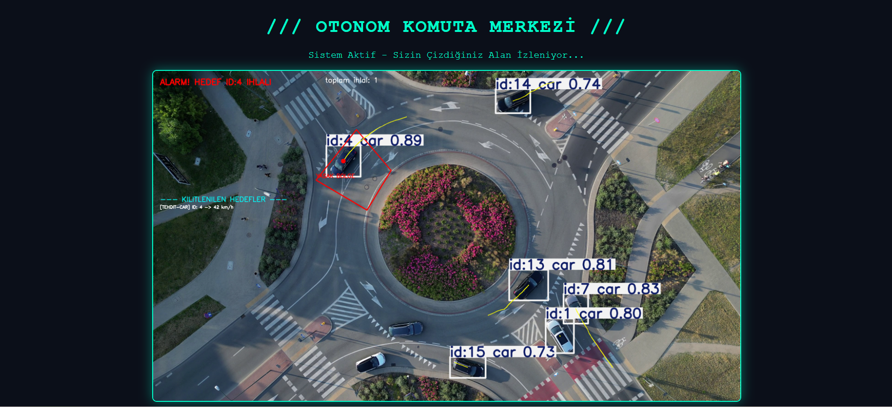

# 🎯 Otonom Taktik Radar Merkezi (Real-Time Drone Vision & Radar)

Bu proje, bilgisayarlı görü ve derin öğrenme algoritmaları kullanılarak geliştirilmiş gerçek zamanlı bir **alan ihlal tespit, hedef takibi ve hız ölçüm** sistemidir. Sistem, kamera veya drone açısından bağımsız olarak çalışır ve kullanıcıya interaktif bir taktik harita çizme imkanı sunar. Arka planda tespit edilen tehditler, asenkron olarak çalışan Flask tabanlı bir web paneline canlı olarak aktarılır.

## 🚀 Temel Özellikler
* **YOLOv8 ile Nesne Tespiti:** Yüksek doğrulukla çoklu araç tespiti ve ID ataması (Object Tracking).
* **İnteraktif Yasak Bölge (Geofencing):** OpenCV `setMouseCallback` ile anında ve dinamik alan belirleme.
* **Canlı Hız Kestirimi:** Önceki ve anlık merkez koordinatları (X, Y) üzerinden matematiksel mesafe algoritmalarıyla anlık km/h hesabı.
* **Asenkron Web Dashboard:** Flask arka planı ve JavaScript Fetch API kullanılarak, video akışı ve ihlal veri paneli eşzamanlı olarak sunulur. Sayfa yenilenmeden veriler saniyede bir güncellenir.

## 💻 Kullanılan Teknolojiler
* **Yapay Zeka & Görüntü İşleme:** Python, OpenCV, Ultralytics (YOLOv8)
* **Backend & Web Sunucusu:** Flask, Werkzeug
* **Frontend:** HTML5, CSS3, Vanilla JavaScript (AJAX)

## 📸 Sistem Ekran Görüntüsü


## 🛠️ Kurulum ve Çalıştırma (Adım Adım Rehber)

Projeyi kendi bilgisayarınızda sıfırdan çalıştırmak için terminalinizde sırasıyla aşağıdaki adımları izleyin:

**Projeyi bilgisayarınıza indirin:**
```bash
git clone [https://github.com/imgesucakmak/RealTime-Drone-Vision.git](https://github.com/imgesucakmak/RealTime-Drone-Vision.git)
cd RealTime-Drone-Vision
python -m venv venv
venv\Scripts\activate
pip install -r requirements.txt
python main.py
